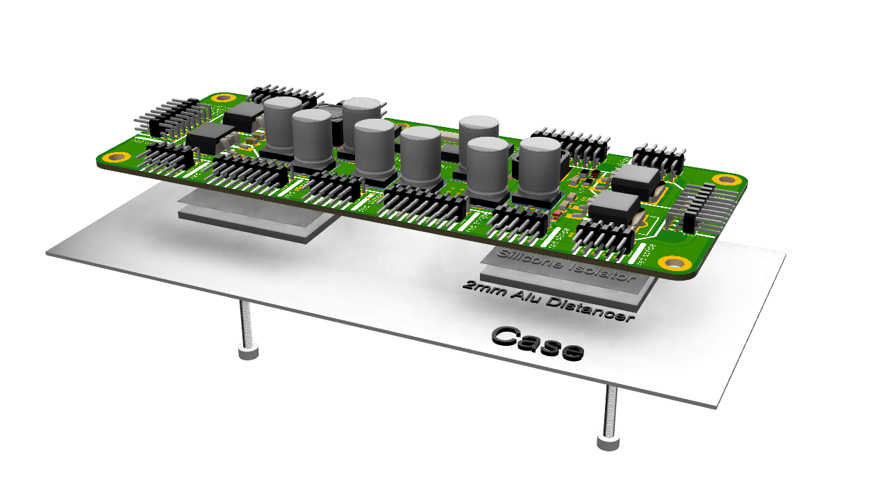

# mbStromer

The Asymmetric Power Supply for Eurorack.



Provides up to 50W, oldschool linear regulator stuff (low noise), for use with a transformer (2x12V 50VA)

With heatsink: 50W
* 12V 3A
* -12V 1A

Without heatsink 25W
* 12V ~1.5A
* -12V ~0.5A

## Status

Under testing, minor fixes pending...

## Mounting

The board can be mounted on a heatsink or directly onto the metal case back, which then becomes the heatsink. You will need 2 silicone pads and 2 Alu/Copper distance peaces 30x40mm. Use the center screw holes to minimize stress on the pcb.

When used without heatsink, put it on distancers so air can circulate around the board which is designed to be disipate a little heat as well.

### Bugs (beta)

* 7912 has no ground conn ! patch it.

## Todo

* Add 5V option ? No one uses it anyway !? Disturbs fend-shui of the layout :-P

## License

#### Attribution-NonCommercial-ShareAlike - CC BY-NC-SA 

```
Attribution — You must give appropriate credit, provide a link to the license, and indicate if changes were made. You may do so in any reasonable manner, but not in any way that suggests the licensor endorses you or your use.

NonCommercial — You may not use the material for commercial purposes.

ShareAlike — If you remix, transform, or build upon the material, you must distribute your contributions under the same license as the original.

No additional restrictions — You may not apply legal terms or technological measures that legally restrict others from doing anything the license permits.
```
[All the legal blabla here](https://creativecommons.org/licenses/by-nc-sa/4.0/legalcode)
