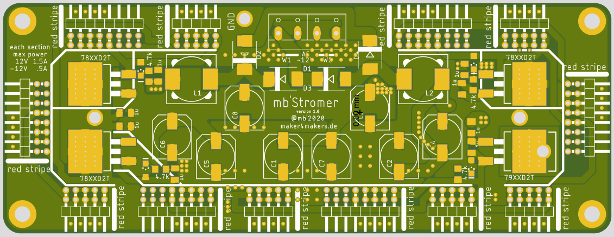

# mbStromer

The Asymetric Power Supply for Eurorack.

Provides up to 50W, oldschool linear regulator stuff (low noise), for use with a transformer (2x12V 50VA)
* 12V 3A
* -12V 1A

## Status

**Not testet**, In Development... Just started to collaborate with my other self(s).

## Todo

* Think Heat Distribution
* Add 5V option ? No one uses it anyway !?
* Add Filters ?
